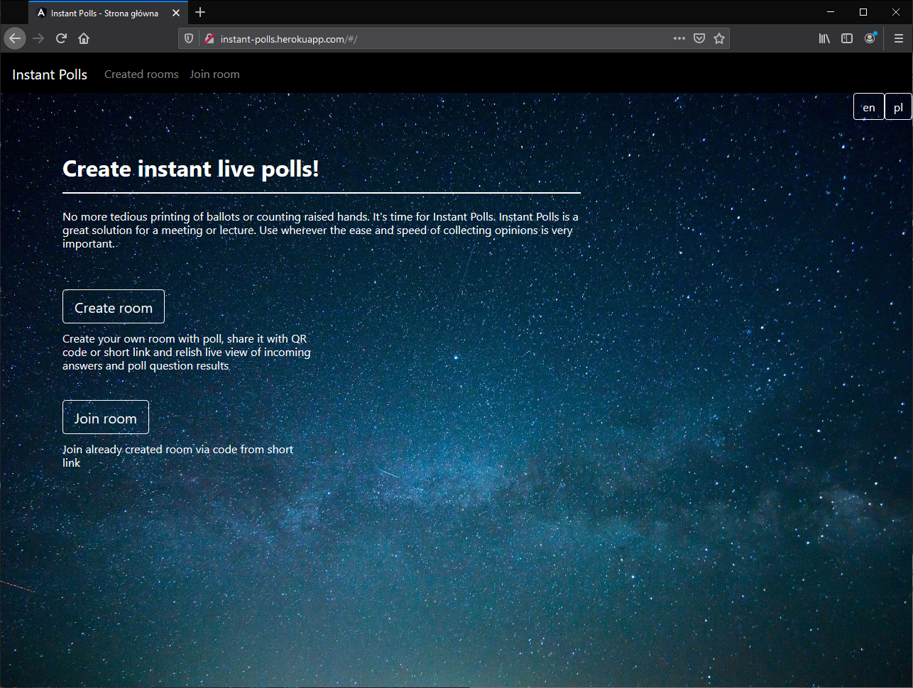
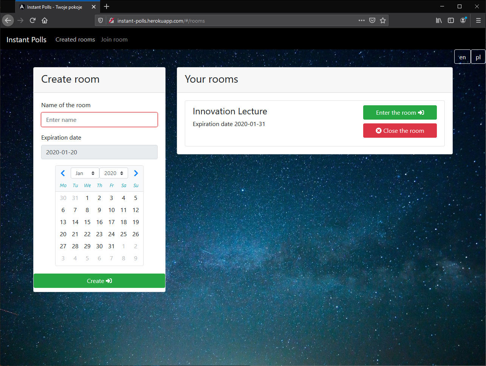

# Instant Polls (innovativeproject-instant-poll)[](https://travis-ci.com/nokia-wroclaw/innovativeproject-instant-poll)


>Solution to gather ad-hoc feedback to any question from live audience.


Web app is served here: [http://instantpoll.live](http://instantpoll.live) and here [https://instant-polls.herokuapp.com/](https://instant-polls.herokuapp.com). First server works better and is recommend 

Originally developed by [Jan Kulbiński](https://github.com/JanKulbinski), [Adam Malinowski](https://github.com/unaceeds), [Piotr Szalski](https://github.com/PiotrSzalski) and [Jakub Wujec](https://github.com/JakubWujec) within Nokia Innovative Project.



## Table of contents

* [The idea](#the-idea)
* [Features overview](#features-overview)
* [Usage](#usage)

## The idea

Create instant live polls! No more tedious printing of ballots or counting raised hands. It's time for Instant Polls. Instant Polls is a great solution for a meeting or lecture. Use wherever the ease and speed of collecting opinions is very important.

### Project goals

With this application you get the ability to create your own room with poll, share it with QR code or short link and relish live view of incoming answers and poll question results. It is also possible to join already created room via code from short link.

### Technologies

It's a web application with the front-end structured with Angular framework and the back-end made in Java - Spring Boot to be exact.

## Features overview

It is assumed that two groups of final users exist. First one consists of standard users, who create rooms, join these, that were previously created and most importantly - cast votes in the actual polls. Second one is actually an amplifying extension to the preceding. Creating a room makes user its host and gives him among other the ability to manage questions, make their answer summary visible, switch the voting permission and so on.

All the use cases according to the UML diagram and the application itself are shown below. They depend on the currently visited page.

### Main page



The main page provides the following options for both of the user groups:
* creating a poll room (with giving it a name and expiration date)
* joining a poll room (either by the QR code, short-link or just the code from its end)
* viewing recently visited rooms
* viewing recently created rooms

### Room page


However moving on to the actual room page makes the differences more visible between the user groups.
* for non-host user (the standard one)
	* viewing the QR code of the room (that way more users can join either from the one projected on some kind of screen or just by asking a person sitting next to them to see it)
	* answering the questions (choosing answer/s)
	* leaving the room
* for the host (which is just the so called expansion as mentioned above)
	* creating questions with the choose between three different types:
		* yes/no question
		* the multiple answer one (single and multiple choice)
		* range rating
	* deleting questions
	* locking questions so that no one could make a vote anymore
	* disabling the possibility to view the voting summaries
	* archiving all the votes made in the room for future analysis
	* closing the room

## Usage

### Deployment

In our case the application is fully deployed on cloud application platform called Heroku. Although its performance possibilities are quite limited, that way the Instant Poll App has been made available for users all over the world without the need for hosting it on some kind of private server.

[Instant Live Polls](http://instant-polls.herokuapp.com)

The continuous integration between consecutive commits is provided by the Travis CI. It makes the development management more pleasant and easy to have control of.

### Local setup

In relation to the fact, that the application is based on Angular and Java, compiling and running it is not a very challenging task.

All the things that have to be done between the preparation of some new feature and seeing it fully functioning locally are:
```
cd frontend
npm install
ng build
cd ../backend
mvn build
java -jar target/InstantPoll-0.0.1-SNAPSHOT.jar
```
